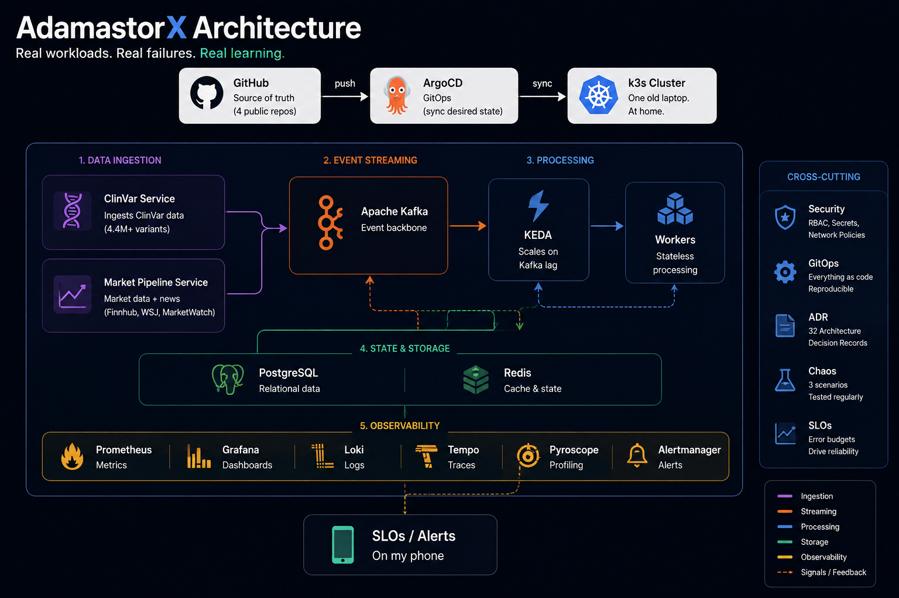

Over the past few weeks I've been building a distributed system at home, with one unusual constraint: AI writes most of the code, and I stay responsible for everything else — the architecture, the review process, and what happens when it breaks.

It's called AdamastorX, and it runs on an old Lenovo T460s laptop, on Xubuntu.

It's less a project than an experiment.

What happens when you give AI enough autonomy to build a complex system, while keeping engineering discipline, architecture, and operational responsibility in human hands?

I'm not trying to build a perfect system. I'm trying to build one realistic enough to fail, and then learn how to operate it.

This post is the how and the why, and the first in a series about what I'm learning.

## Why "Adamastor"?

If you haven't read *Os Lusíadas*, the 1572 epic by the Portuguese poet Luís de Camões, here's the short version of my favorite part. When the Portuguese fleet tries to round the Cape of Good Hope, a giant rises out of the ocean: Adamastor, the spirit of the cape, the personification of every storm and every fear the sailors carried with them. He doesn't sink the ships. He just stands there, enormous, and tells them exactly how hard the crossing will be.

I'm Portuguese, I love the poem, and naming a project after the giant you sail toward anyway felt right. The cape's original name was the Cape of Storms, and was later renamed the Cape of Good Hope. Make of that what you will.

## Why I'm doing this

Two and a half reasons.

First, I wanted to test vibe coding on something that fights back. Not "can AI write a function?", but what happens months later, when AI has written most of a system with real moving parts. Does the architecture hold? Does the documentation rot? Can one person still understand the whole thing?

Second, I wanted an observability stack running against real data instead of demo dashboards. The distance between "I read the docs" and "my own alert just paged me about consumer lag" is where the actual learning lives.

The half: I wanted to watch a project grow under real constraints, and write down what happens.

## What AdamastorX is

AdamastorX is not a product. Nobody will ever buy it, and that's the point. It's a deliberately realistic platform. The kind of system a small platform team might run, built so it produces real problems (capacity limits, flaky deploys, alert noise) that I then have to solve the boring, correct way.

The setup exists to create that realism: a single-node k3s cluster on the laptop, provisioned with Terraform. ArgoCD keeps the cluster in sync with Git. The desired state lives in the repository. On top of that sit Spring Boot and Python services, Kafka, PostgreSQL, Redis, and an observability stack: Prometheus, Grafana, Loki, Tempo, and Pyroscope for continuous profiling. Not because the list looks good, but because the system needs enough real moving parts to expose the kinds of failures I'm trying to learn from.

A snapshot, since this is the "look at my cluster" paragraph anyway: four public repos, eleven services, five Kafka topics, three documented chaos scenarios, and 32 architecture decision records, which are short documents recording why each significant decision was made, including the ones later reversed. Reversals stay in the record too.

Everything is public: [github.com/AdamastorX](https://github.com/AdamastorX).

## What's actually running

Two real workloads, because real workloads produce real failures.

The first is a clinical variant annotation service. It ingests ClinVar, a public database of human genetic variation. The version I loaded contained 4,453,798 records. It answers variant lookups: ask it about `rs80357906` and it tells you that it’s a BRCA1 variant classified as pathogenic.

The second is a market sentiment pipeline: live stock ticks from Finnhub's websocket, news from WSJ and MarketWatch feeds, a sentiment scorer, a Kafka Streams app that windows everything into per-ticker aggregates, and a small dashboard on top. Live data, flowing during real market hours.

Kafka is also where the platform gets to behave like a platform. The workers don't scale on CPU; they scale on the work waiting to be done. KEDA watches Kafka consumer lag and adjusts the worker count accordingly. When messages pile up, more workers appear. When the backlog clears, they disappear again. CPU tells me how busy a worker is; lag tells me whether the system is actually keeping up.

Around both lives the machinery that makes this an experiment instead of a demo: SLOs with alerts that reach my phone. Canary deployments that abort themselves when error rate or latency budgets burn. Chaos drills where I kill Kafka or Postgres on purpose and watch what happens. The failures are the curriculum.

## How I work with AI

The tools change — mostly Claude, sometimes Cursor, sometimes models through OpenRouter. The process doesn't. It's a normal engineering process, and that's the point. The AI writes fast, and the process provides the constraints.

**Context files.** A `PROJECT.md` holds the canonical picture of what exists and why; a `SESSION_STATE.md` is the scratch log of what's in flight right now. Every session starts by reading them. An AI with good context is a different tool from one starting cold.

**Decisions before code.** Anything architectural gets an ADR first. If the AI wants a new tool, it argues for it in writing, sometimes formally overturning an earlier ADR. It sounds bureaucratic for a one-person project but it's what keeps a fast project coherent months later.

**Everything is a pull request.** Small PRs, one concern each, reviewed and merged by me. Often from my phone.

**Specialized personas.** Work gets delegated to agent roles — architect, platform engineer, backend engineer, observability engineer, documentation engineer — so the design conversation and the implementation don't happen in the same breath.

**Fresh-eyes reviews.** Every now and then I pause and ask a stronger model (Fable 5, Opus 5, Kimi k3), with zero context of how anything got built, to review the whole project the way a staff engineer would. The last one reframed the roadmap: the bottleneck is no longer technical depth, it's packaging and drift. That review is a big part of why this article exists.

## What surprised me

The failures are the best part, because they're real. Each one taught me something the design phase couldn't.

A routine deploy once sat broken for 95 minutes while the old version kept serving traffic. The new version was deployed successfully from Kubernetes' perspective, but it was failing its actual application-level behavior. Because the old version continued serving traffic, infrastructure health stayed green and no alert fired. Nothing was technically down, so nothing alerted. You can't learn from a failure you can't see. That incident is why the API now ships as a canary with an automatic SLO-based abort, proven in both directions, a clean promote in under three minutes, and an automatic abort in about the same.

When I added continuous profiling, I reproduced an old crash-looping incident and captured a flame graph to confirm my theory about the cause. The graph disagreed. The time went into the JVM's own JIT compiler, not my application code. I wrote that down too. Being wrong on the record is half the point of keeping records. Telemetry falsifies hypotheses, mine and the AI's alike.

My favorite stupid one: I originally used `.dev` for local hostnames. It turns out `.dev` is a real, HSTS-preloaded top-level domain, and browsers refuse to talk to it over an untrusted certificate with no overrides allowed. No model warns you about that one; you find it live, or you don't find it at all. My local domains now live under `.local.adamastorx.test`.

And then there's the laptop. Its CPU has been 99% allocated on three separate occasions, blocking real work each time. The fix was always the same: measure actual usage, trim what I'd over-provisioned, win back the headroom. A whole milestone is gated on moving to better hardware. Constraints this tight are annoying, and the best SRE teacher I’ve had.

## What this experiment is teaching me

A few weeks in, one observation keeps resurfacing — a hypothesis, not a result: AI makes building cheap, and cheap building makes coherence expensive.

When writing code costs an evening instead of a week, the scarce resource stops being implementation. It's everything around it: docs drifting from reality, decisions going stale, conventions diverging between sessions, the slow growth of a system even its owner has to re-learn. I know the symptoms because I've had them. 

My first fix for documentation drift, a checklist item in the PR template, failed twice, on the same file, weeks apart. The third time it happened, I stopped trying to remember to check and wrote a CI job that checks for me: it fails the build if a live component goes undocumented, or if the backlog file itself gets corrupted the way a bad edit once silently corrupted it. Whether that one sticks is still an open question — but replacing a human habit with a machine check the moment the habit proves unreliable is, I think, the actual shape of the answer this project is circling.

I don't have data that proves this generalizes. I have one project, one laptop, and a growing suspicion that as implementation gets faster, the discipline around it stops being hygiene and becomes the actual work. Which might be the early answer to the experiment's question: giving AI autonomy over the code has worked, so far, precisely because the autonomy stops at the code.

## What's next

Making the project presentable is literally a milestone on the roadmap, and this article is part of it. After that: closing the gaps a fast expansion phase always opens — missing dashboards, event contracts, long-term metrics retention, a first proper SLO report. Fittingly, several of those are coherence problems.

I'll keep writing here as I go: the canary deploys, the outbox pattern for guaranteed delivery, what a fresh-eyes AI review actually looks like in practice. If you want to follow along, everything is public at [github.com/AdamastorX](https://github.com/AdamastorX).

The giant is still out there. So far, so good.

**A note on AI:** Yes, I used AI to write this article too. It helped with structure, wording, and editing; the experiences, decisions, and opinions are mine.
